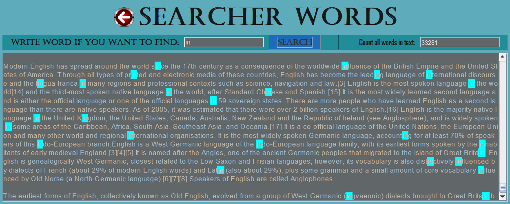

# _Find Words_ 🔎📃

## Preview 
1. This project uses jdk 11, Swing;
2. Project consists of 2 levels such as: ui, domain;
3. Project uses `Swing` interface;
4. System can be extended;
5. For testing the system uses `JUnit5`;

## About
In this project, a search for a word in the text was implemented. All found words are highlighted in blue. The project can be to add features in a future. In the project, at the moment, search is implemented only for JTextArea.

## Launch guide
To run this project you will need to install JDK 11 or higher.
Here are the steps for you to follow:
- Add this project to your IDE as Maven project;
- If necessary, configure Java SDK 11 in Project Structure settings;
- This project will be searching word in strings that have in the end this symbols: ., ?, !. (, - this symbol does not count).

## Features
☑️Search for the number of words in a text;
 ☑️Search for a word in a text;
 ☑️The ability to add text to the application.

## Testing Program
### _Main Menu_

### _Result find words in JTextArea in Swing_
